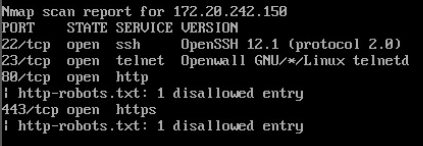

# Palo Alto Firewall

#### Upgrade Palo Alto Software
- Use [these instructions](https://knowledgebase.paloaltonetworks.com/KCSArticleDetail?id=kA10g000000CloaCAC)

#### Setup Network Objects
- Login to Palo Alto web GUI at the IP address `172.20.242.150`
- Add an Address Object for each individual IP on the network
  - Bottom left section, may be minimized
- Use these to restrict communications per machine for max granularity

#### Firewall Rules
| Name                 | Action | src Zone               | src Addr | dest Zone | dest Addr       | App | Service          | 
|----------------------|--------|------------------------|----------|-----------|-----------------|-----|------------------| 
| DROP ALL             | drop   | any                    | any      | any       | any             | any | any              | 
| internal DNS routing | allow  | internal, public, user | any      | user      | ubuntu, Win2008 | any | DNS-TCP, DNS-UDP | 

