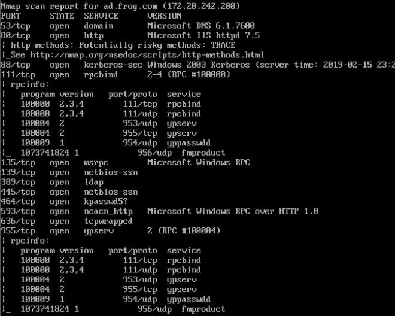
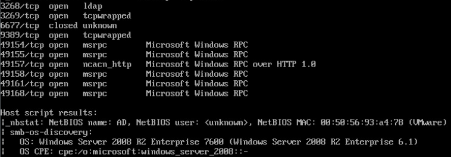
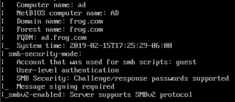

# Windows 2008 R2

  
  

This machine is the AD machine. There were a bunch of user accounts on there and I had no idea what the passwords were set to, so I made a script to change them. For what it's worth, the command `dsquery group` will list all groups in AD. The ones I felt we needed to change the most were Domain Users and Domain Admins. Fortunately, there is just one account in Domain Admins (Administrator), but we'll need to double check this before we start tomorrow. We'll want to change the Users and Administrators groups as well. Changing all groups may be dangerous, but if we can I recommend it.
